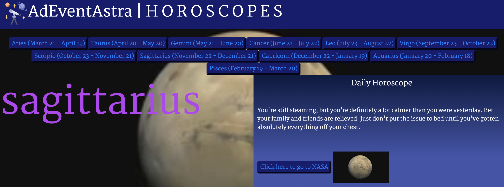

# Horoscope Group Project: Working with API's

## Interactive Front-End Application
This project will be a centerpiece for our portfolio and our first opportunity to show employers our collaborative skills and coding abilities. Employers want to see what we can do, but they also want to see how we work with other developers. The more examples of deployed collaborative work we have in our portfolio, the more likely we are to get an interview and a job. One of the requirements for this project is that we add it to our portfolio.

## Project Requirements
With our team, we'll conceive and execute a design that solves a real-world problem by integrating data received from multiple server-side API requests. We'll also learn about agile development methodologies to help we work collaboratively. We'll implement feature and bug fixes using Git branch workflow and pull requests.

We'll write our own user stories and acceptance criteria in GitHub Issues to help our team stay on track with the project. Using GitHub Project to track the status of our project tasks will help we understand the benefits of Kanban boards.

Our group will use everything we’ve learned to create a real-world front-end application that we’ll be able to showcase to potential employers.

## User story 
* AS AN astrology and astronomy enthusiast
* I WANT to see the horoscope outlook for my day
* SO THAT I can view my predictions depending on my star sign.

## Technologies used

* Nasa and Aztro Server APIs
* Html, CSS, JavaScript, Bootstrap, jQuery, Google Fonts, GitHub

## Demo
* URL of deployed application:
https://adeventastra.github.io/project1-piptambecten/
<!-- screenshot and URL -->
* Original version (MVP)
    
* New interface
    

## Licence
MIT Licence

## Authors
* Tamara Joniec
* Rebecca Sellers
* Pip Allen
* Tennisson Omovoh

## References
* Google Fonts
* Nasa API: https://images-api.nasa.gov/search?q=planets
* Horoscope API: https://aztro.sameerkumar.website/?sign=undefined&day=today

## Credits
* Martin William (TA)
